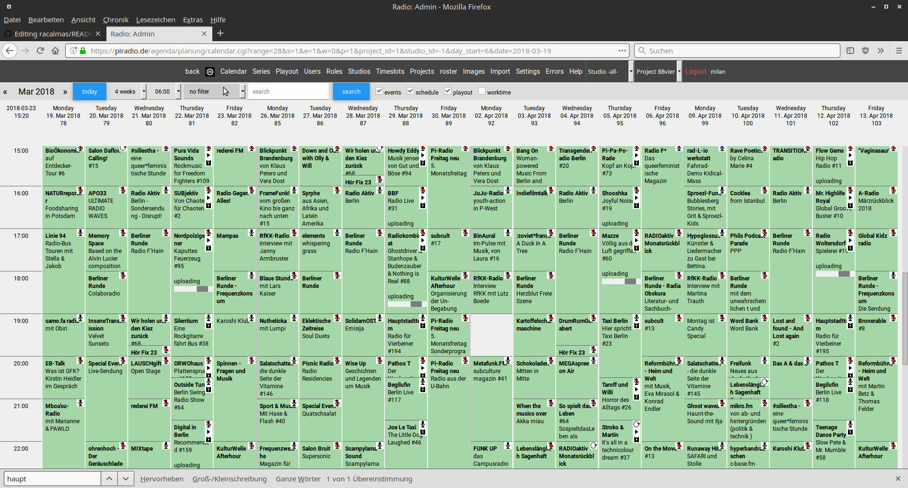
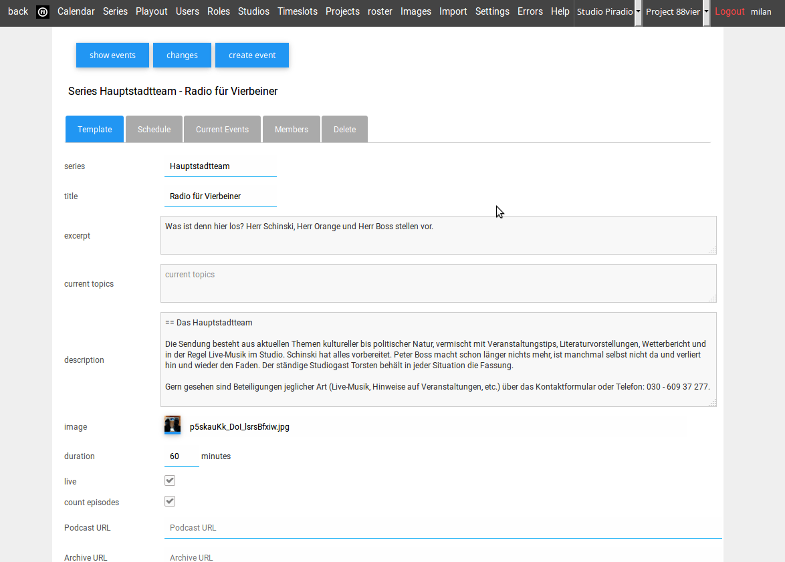
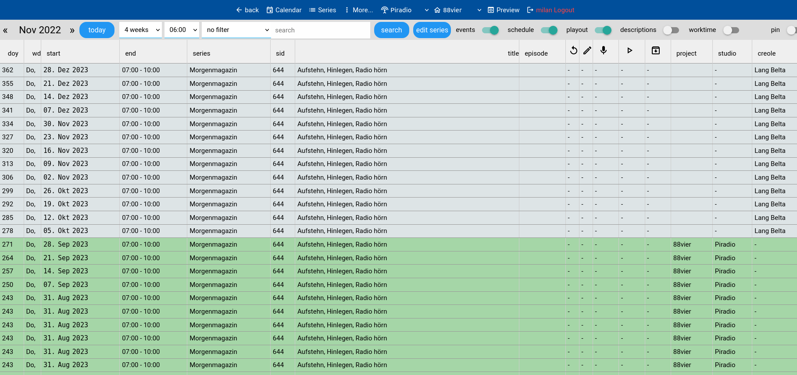
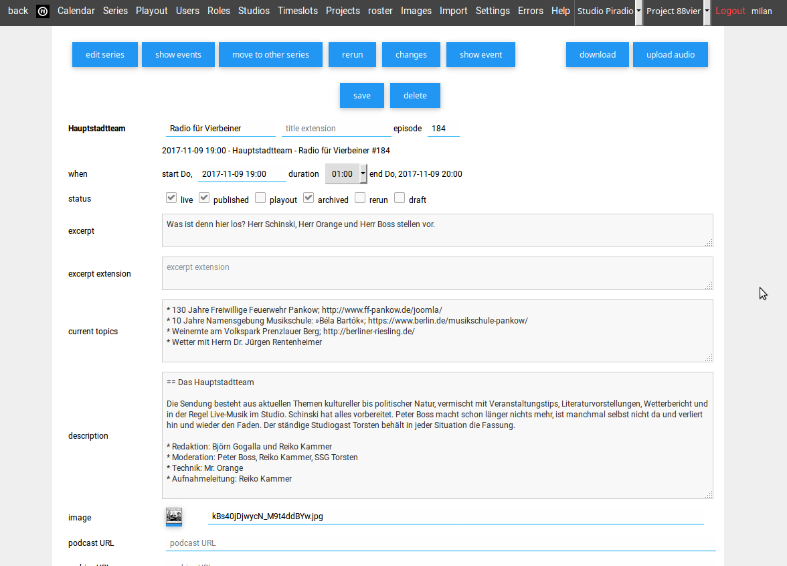
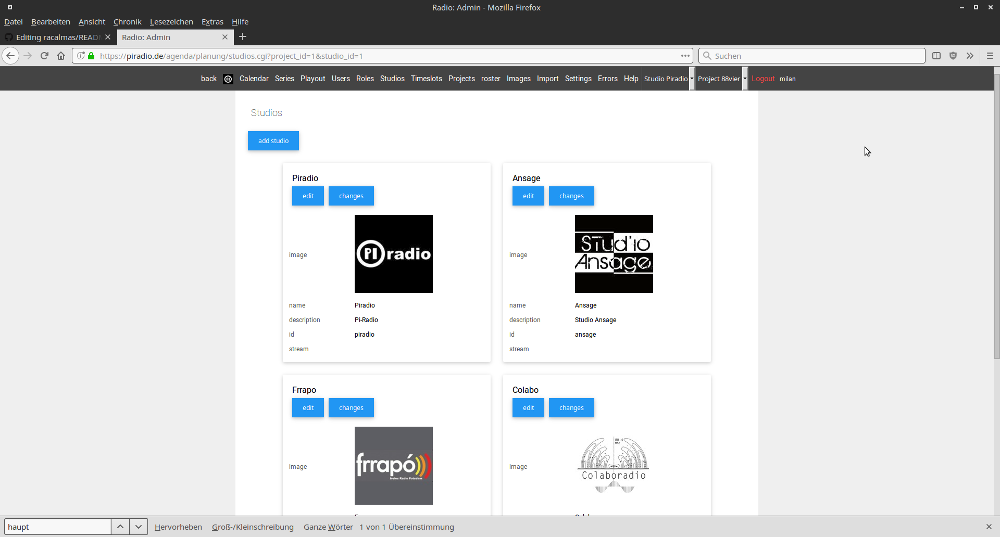
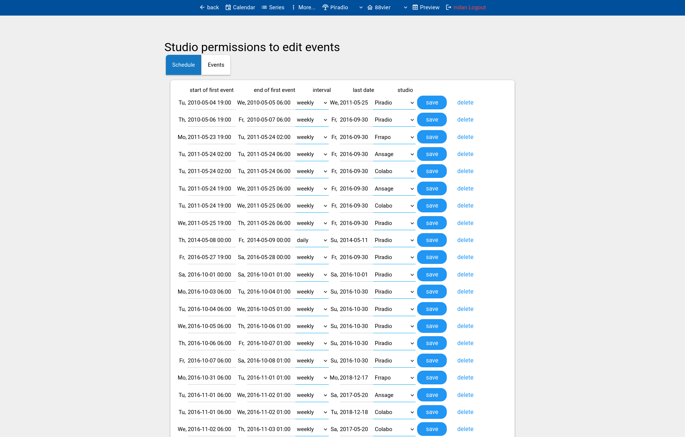
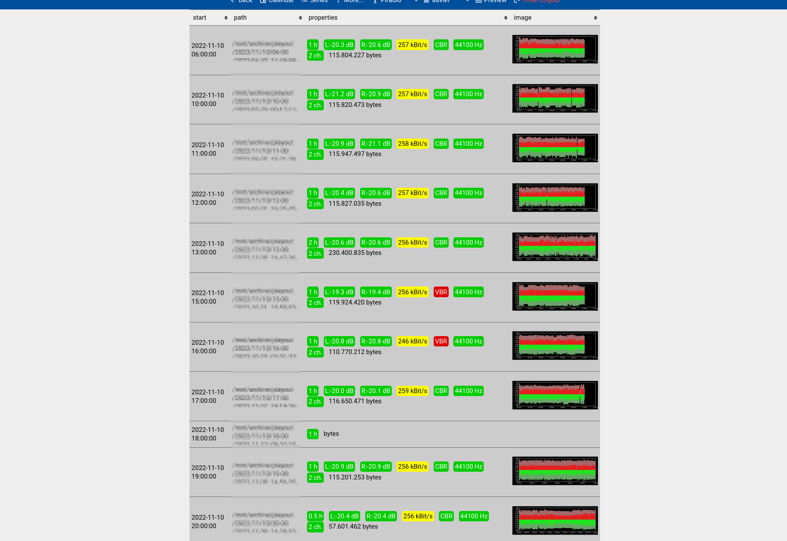

# racalmas
radio calendar management system

public view

management view

edit series 

show events of series

edit event

manage studios

schedule studio broadcast time

edit roles per project and studio

import and show status of external playout system

