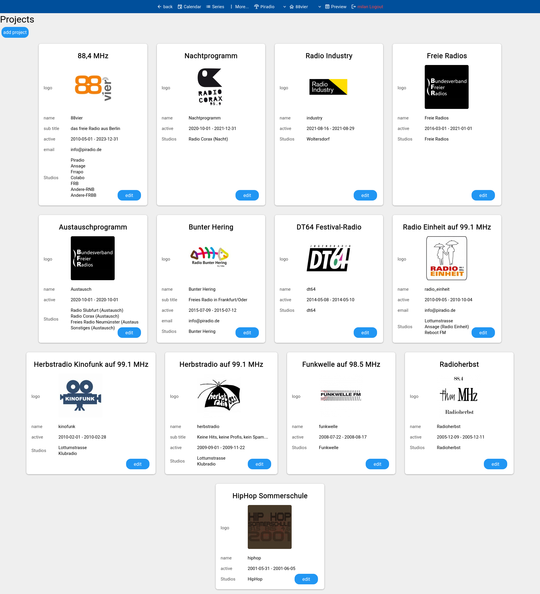
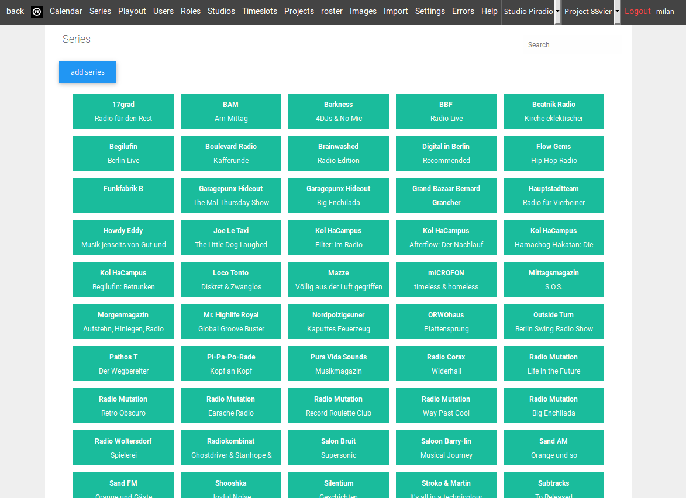
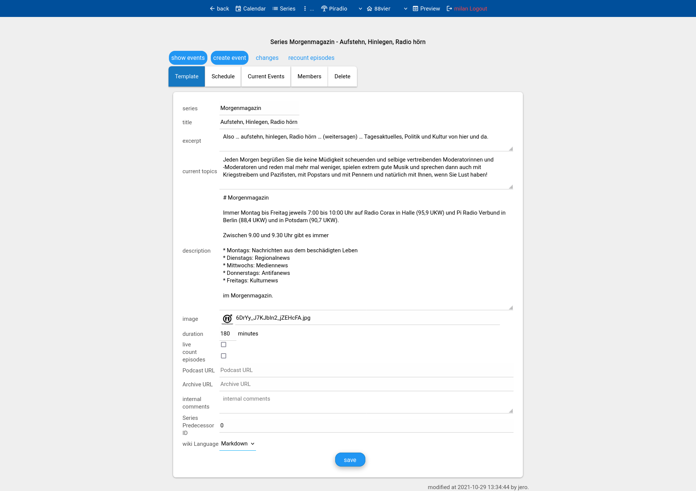
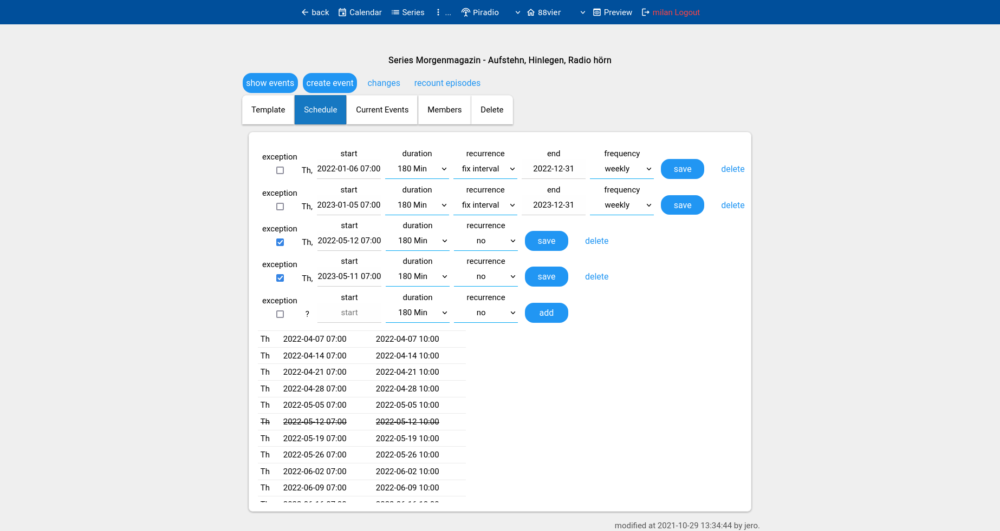

#radio calendar management system

Web View

Projects

Studios

Assign Roles by Project and Studio

Schedule Studio Broadcast Time

Event Calendar

Series

Edit Series 

Schedule Series 

List Series Events

Edit Event

Ingegrated View on External Playout System

